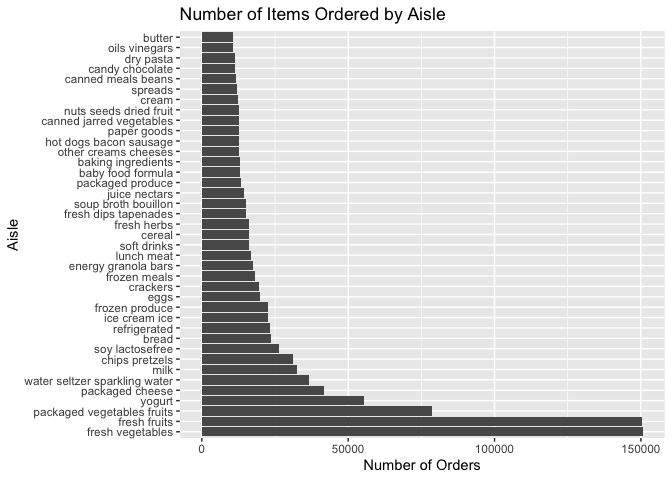

p8105_hw3_th3072
================

``` r
library(tidyverse)
```

    ## ── Attaching core tidyverse packages ──────────────────────── tidyverse 2.0.0 ──
    ## ✔ dplyr     1.1.3     ✔ readr     2.1.4
    ## ✔ forcats   1.0.0     ✔ stringr   1.5.0
    ## ✔ ggplot2   3.4.3     ✔ tibble    3.2.1
    ## ✔ lubridate 1.9.2     ✔ tidyr     1.3.0
    ## ✔ purrr     1.0.2     
    ## ── Conflicts ────────────────────────────────────────── tidyverse_conflicts() ──
    ## ✖ dplyr::filter() masks stats::filter()
    ## ✖ dplyr::lag()    masks stats::lag()
    ## ℹ Use the conflicted package (<http://conflicted.r-lib.org/>) to force all conflicts to become errors

``` r
library(p8105.datasets)
```

# Problem 1

## part 1

``` r
data("instacart")
# Number of aisles
number_aisles <- nrow(instacart)

# Aisles with most orders
aisles_most_ordered <- instacart |>
  group_by(aisle) |>
  summarise(count = n()) |>
  arrange(-count)
```

## part 2

``` r
filtered_aisles <- aisles_most_ordered |>
  filter(count > 10000)

ggplot(filtered_aisles, aes(x = reorder(aisle, -count), y = count)) +
  geom_bar(stat = "identity") +
  coord_flip() +
  labs(title = "Number of Items Ordered by Aisle", x = "Aisle", y = "Number of Orders")
```

<!-- -->

``` r
popular_items <- instacart %>%
  filter(aisle %in% c("baking ingredients", "dog food care", "packaged vegetables fruits")) %>%
  group_by(aisle, product_name) %>%
  summarise(count = n()) %>%
  arrange(aisle, -count) %>%
  group_by(aisle) %>%
  slice_head(n = 3)
```

    ## `summarise()` has grouped output by 'aisle'. You can override using the
    ## `.groups` argument.

``` r
print(popular_items)
```

    ## # A tibble: 9 × 3
    ## # Groups:   aisle [3]
    ##   aisle                      product_name                                  count
    ##   <chr>                      <chr>                                         <int>
    ## 1 baking ingredients         Light Brown Sugar                               499
    ## 2 baking ingredients         Pure Baking Soda                                387
    ## 3 baking ingredients         Cane Sugar                                      336
    ## 4 dog food care              Snack Sticks Chicken & Rice Recipe Dog Treats    30
    ## 5 dog food care              Organix Chicken & Brown Rice Recipe              28
    ## 6 dog food care              Small Dog Biscuits                               26
    ## 7 packaged vegetables fruits Organic Baby Spinach                           9784
    ## 8 packaged vegetables fruits Organic Raspberries                            5546
    ## 9 packaged vegetables fruits Organic Blueberries                            4966

``` r
mean_hour <- instacart %>%
  filter(product_name %in% c("Pink Lady Apples", "Coffee Ice Cream")) %>%
  group_by(product_name, order_dow) %>%
  summarise(mean_hour = mean(order_hour_of_day)) %>%
  spread(key = product_name, value = mean_hour)
```

    ## `summarise()` has grouped output by 'product_name'. You can override using the
    ## `.groups` argument.
