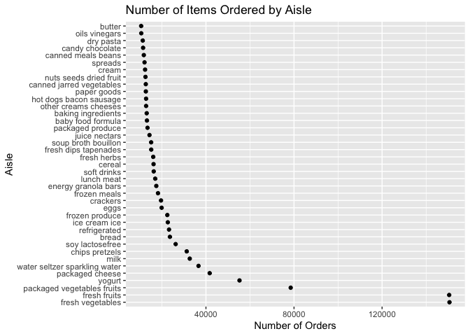
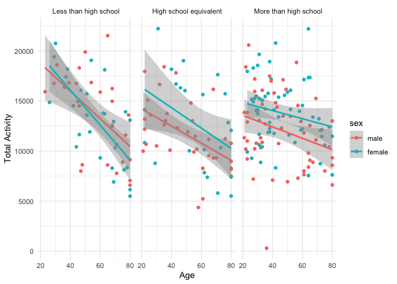

p8105_hw3_th3072
================

``` r
library(tidyverse)
```

    ## ── Attaching core tidyverse packages ──────────────────────── tidyverse 2.0.0 ──
    ## ✔ dplyr     1.1.3     ✔ readr     2.1.4
    ## ✔ forcats   1.0.0     ✔ stringr   1.5.0
    ## ✔ ggplot2   3.4.3     ✔ tibble    3.2.1
    ## ✔ lubridate 1.9.2     ✔ tidyr     1.3.0
    ## ✔ purrr     1.0.2     
    ## ── Conflicts ────────────────────────────────────────── tidyverse_conflicts() ──
    ## ✖ dplyr::filter() masks stats::filter()
    ## ✖ dplyr::lag()    masks stats::lag()
    ## ℹ Use the conflicted package (<http://conflicted.r-lib.org/>) to force all conflicts to become errors

``` r
library(p8105.datasets)
```

# Problem 1

## part 1

``` r
data("instacart")
# Number of aisles
number_aisles <- nrow(instacart)

# Aisles with most orders
aisles_most_ordered <- instacart |>
  group_by(aisle) |>
  summarize(count = n()) |>
  arrange(-count)
```

## part 2

``` r
filtered_aisles <- aisles_most_ordered |>
  filter(count > 10000)

ggplot(filtered_aisles, aes(x = reorder(aisle, -count), y = count)) +
  geom_point() +
  coord_flip() +
  labs(title = "Number of Items Ordered by Aisle", x = "Aisle", y = "Number of Orders")
```

<!-- -->

``` r
popular_items <- instacart |>
  filter(aisle %in% c("baking ingredients", "dog food care", "packaged vegetables fruits")) |>
  group_by(aisle, product_name) |>
  summarize(count = n(), .groups = 'drop') |>
  arrange(aisle, -count) |>
  group_by(aisle) |>
  slice_head(n = 3)
```

``` r
mean_hour <- instacart |>
  filter(product_name %in% c("Pink Lady Apples", "Coffee Ice Cream")) |>
  group_by(product_name, order_dow) |>
  summarize(mean_hour = mean(order_hour_of_day)) |>
  pivot_wider(
    names_from = product_name,
    values_from = mean_hour
  )
```

    ## `summarise()` has grouped output by 'product_name'. You can override using the
    ## `.groups` argument.

# Problem 2

``` r
data("brfss_smart2010")
brfss_cleaned <- brfss_smart2010 |>
  select(Year, Locationabbr, Locationdesc, Topic, Response, Data_value) |>
  filter(Topic == "Overall Health", 
         Response %in% c("Excellent", "Very Good", "Good", "Fair", "Poor")) |>
  mutate(Response = factor(Response, 
                           levels = c("Poor", "Fair", "Good", "Very Good", "Excellent"), 
                           ordered = TRUE))
```

``` r
excellent_data <- brfss_cleaned %>%
  filter(Response == "Excellent") %>%
  group_by(Year, Locationabbr) %>%
  summarize(mean_data_value = mean(Data_value, na.rm = TRUE))
```

    ## `summarise()` has grouped output by 'Year'. You can override using the
    ## `.groups` argument.

``` r
ggplot(excellent_data, aes(x = Year, y = mean_data_value, group = Locationabbr, color = Locationabbr)) +
  geom_line() +
  theme_minimal() +
  labs(title = "Average Data Value for 'Excellent' Responses Over Time", 
       y = "Average Data Value")
```

<!-- -->

``` r
ny_data <- brfss_cleaned |>
  filter(Locationabbr == "NY" & (Year == 2006 | Year == 2010))

ggplot(ny_data, aes(x = Response, y = Data_value)) +
  geom_boxplot() +
  facet_grid(. ~ Year) +
  theme_minimal() +
  labs(title = "Distribution of Data Value for Responses in NY State (2006 & 2010)", 
       y = "Data Value")
```

<!-- -->

# Problem 3

``` r
demo_data <- read.csv("./hw3_data/nhanes_covar.csv", skip = 4)
accel_data <- read.csv("./hw3_data/nhanes_accel.csv")

# Merge the two datasets based on a common identifier, e.g., participant_id
merged_data <- merge(demo_data, accel_data, by = "SEQN")
```

``` r
merged_data$sex <- ifelse(merged_data$sex ==1, "male", "female")
merged_data$education <- ifelse(merged_data$education ==1, "Less than high school",
                            ifelse(merged_data$education == 2, "High school equivalent", "More than high school"))
cleaned_data <- merged_data |>
  filter(age >= 21, !is.na(sex), !is.na(education), !is.na(BMI), !is.na(age)) |>
  mutate(sex = factor(sex, levels = c("male", "female")),
         education = factor(education, levels = c("Less than high school", "High school equivalent", "More than high school")))
```

``` r
education_gender_table <- cleaned_data %>%
  group_by(education, sex) %>%
  summarize(count = n())
```

    ## `summarise()` has grouped output by 'education'. You can override using the
    ## `.groups` argument.

``` r
cleaned_data %>%
  ggplot(aes(x = age, color = sex)) +
  geom_histogram(binwidth = 5) +
  facet_grid(~ education) +
  labs(title = "Age distributions by gender and education level",
       x = "Age",
       y = "Count") +
  theme_minimal()
```

<!-- -->

``` r
# Aggregate activity data
activity_summary <- cleaned_data|>
  group_by(SEQN,education,sex,age)|>
  pivot_longer(
  min1:min1440,
  names_to = "time",
  values_to = "activity"
  )|>
  summarize(totalactivity = sum (activity))
```

    ## `summarise()` has grouped output by 'SEQN', 'education', 'sex'. You can
    ## override using the `.groups` argument.

``` r
# Plot total activities against age
ggplot(activity_summary, aes(x = age, y = totalactivity, color = sex)) +
  geom_point() +
  geom_smooth(method = "lm") +
  facet_grid(~education) +
  labs(x = "Age", y = "Total Activity", color = "sex") +
  theme_minimal()
```

    ## `geom_smooth()` using formula = 'y ~ x'

<!-- -->

``` r
min <- cleaned_data|>
  group_by(SEQN,education,sex,age)|>
  pivot_longer(
  min1:min1440,
  names_to = "time",
  values_to = "min"
  )|>
  summarize(min = mean (min))
```

    ## `summarise()` has grouped output by 'SEQN', 'education', 'sex'. You can
    ## override using the `.groups` argument.

``` r
# Plot 24-hour activity time courses
ggplot(min, aes(x = min, y = age, color = sex)) +
  geom_smooth() +
  facet_wrap(~education) +
  labs(x = "Minute of the Day", y = "MIMS", color = "sex") +
  theme_minimal()
```

    ## `geom_smooth()` using method = 'loess' and formula = 'y ~ x'

<!-- -->
